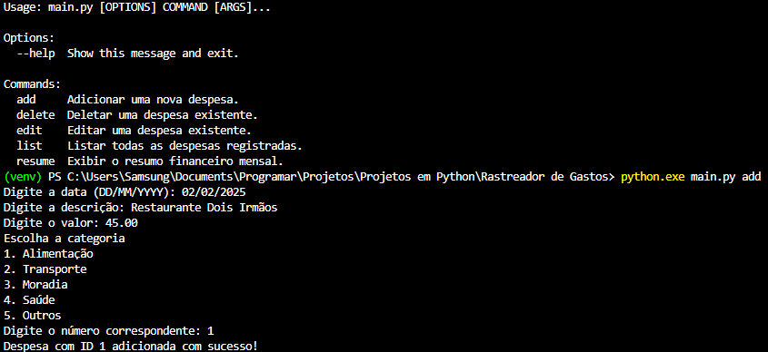

# Rastreador-de-Gastos-em-Python

Este projeto é um gerenciador de despesas pessoais que funciona via terminal. Ele utiliza a biblioteca Click para gerenciar os comandos e argumentos, e a biblioteca Rich para renderizar tabelas informativas, por meio de dados brutos de um arquivo CSV. 

<p align = "left">

</p>

## Demonstração



Interface do rastreador de gastos em execução no terminal.

## Instalação e Pré-requisitos

### Pré-requisitos

- Python 3.8 ou superior instalado no sistema;
- Terminal ou prompt de comando para executar o programa;
- Sistema operacional Windows, Linux ou macOS.

### Passos para Instalar

1. Baixe ou clone o projeto;
2. Verifique se você possui Python 3 instalado no computador.

### Como Instalar as Dependências

1. Abra o Terminal, dentro da pasta do projeto;
   
2. Execute o seguinte comando para instalar a biblioteca click:
   ```
   pip install click 
   ```
   
3. Execute o seguinte comando para instalar a biblioteca rich:
   ```
   pip install rich
   ```
   
## Usos e Exemplos

Após baixar ou clonar o projeto, siga os passos abaixo para executar o jogo no terminal.

### Executando o Rastreador de Gastos:

No Windows:

```
python main.py
```

No Linux/macOS:

```
python3 main.py
```

## Como Utilizar

1. No terminal, digite "python main.py add" para adicionar uma despesa. Digite sua data, descrição, valor e categoria conforme as instruções;

2. No terminal, digite "python main.py edit", com o ID como argumento, para editar uma despesa já existente. Digite a nova data, descrição, valor e categoria conforme as instruções (caso não queira editar alguma informação, digite enter);

3. No terminal, digite "python main.py delete", com o ID como argumento, para remover uma despesa já existente;

4. No terminal, digite "python main.py list", com "category" e "month-year" como argumentos opcionais, para listar as despesas adicionadas. Category deve ter uma categoria como argumento e month-year deve ter uma data no formato (MM/YYYY) como argumento;

5. No terminal, digite "python main.py resume", com o mês e ano (MM/YYYY) como argumento, para o terminal fornecer informações sobre cada despesa relativa a data fornecida, como sua porcentagem em relação ao valor total.

## Estrutura do Projeto

```
Ratreador-de-Gastos-em-Python/
├── assets/
│   └── Rastreador-de-Gastos-Terminal.png
├── LICENSE
├── README.md
└── main.py 
```

## Licença 

Este projeto está licenciado sob a MIT License - veja o arquivo [LICENSE](LICENSE) para mais detalhes. 
